# school-management-system
PHP School management system developed for schools or small institutes. You can use this to maintain record's related to students, teachers, and other.

## Technolgies Used 
  1. PHP (8.2)
  2. MySQL database
  3. Bootstrap 5
  4. JQery, JavaScript
  5. HTML, CSS

## FEATURES 
  1. student record management
  2. Teacher record management
  3. Leave Management
  4. Notice Upload
  5. Exam result upload
  6. Notes upload
  7. Bus Service 
  8. Syllabus upload / update
  9. Time table
  10. Attendence Management
  11. Password change
  12. Front Page
  13. Single login
  14. Dark theme support

## Screenshots

### Pre-View

     

        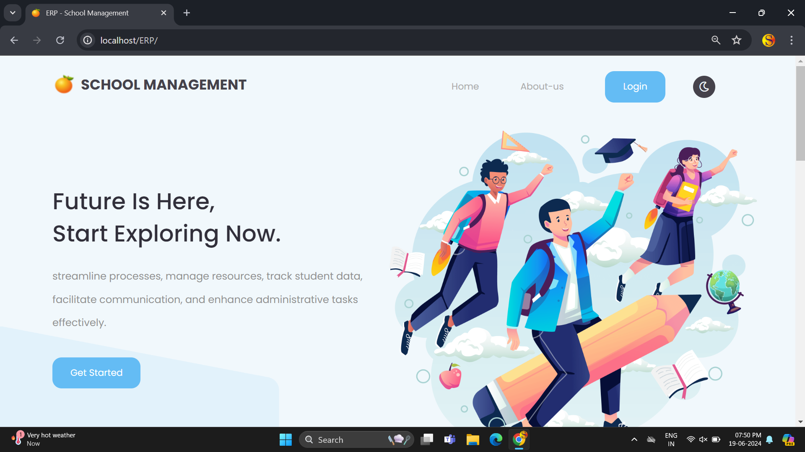
        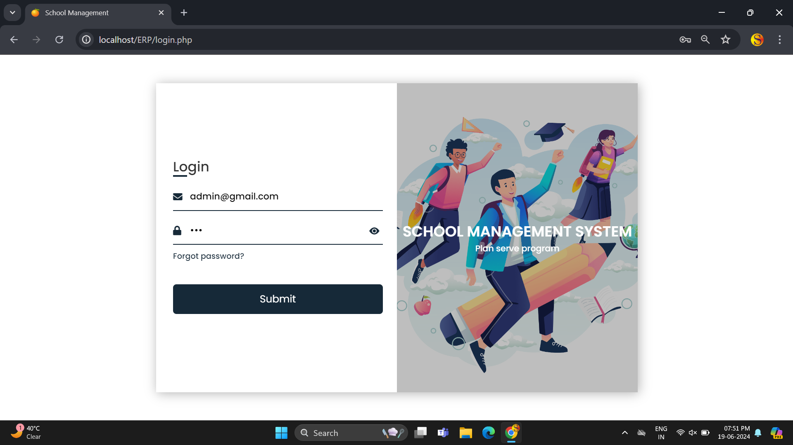
    

 

### Admin View

   

        
        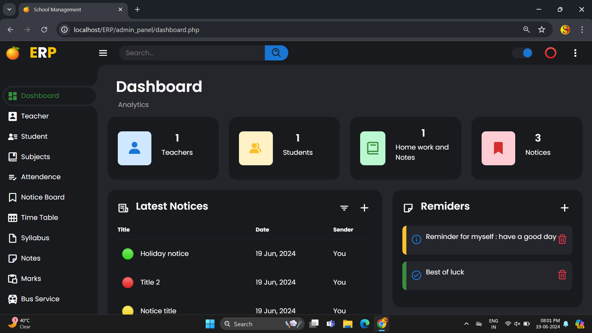
    

     

        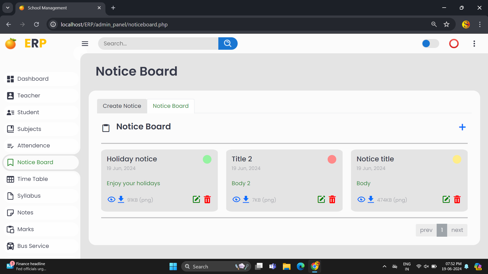
        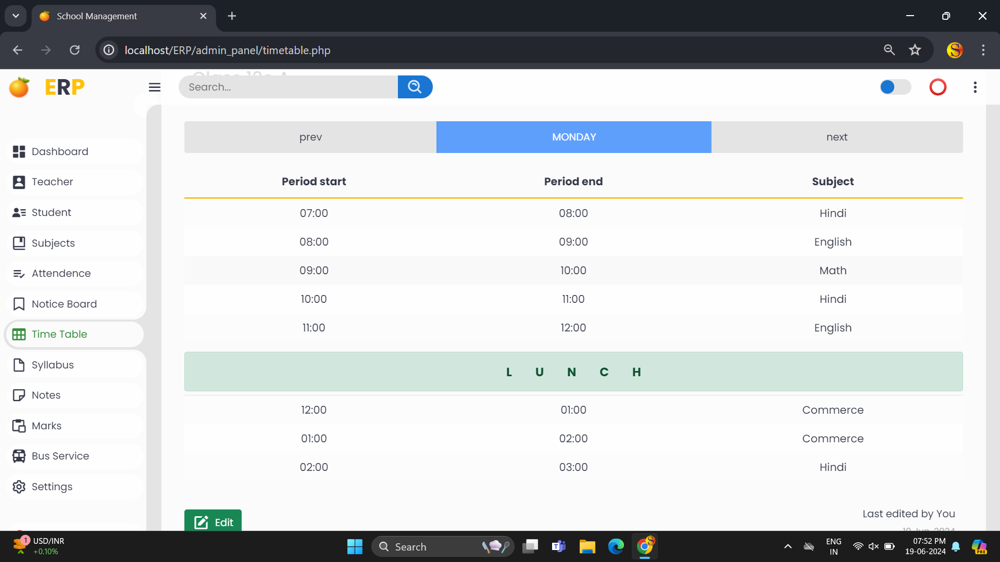
    

     

        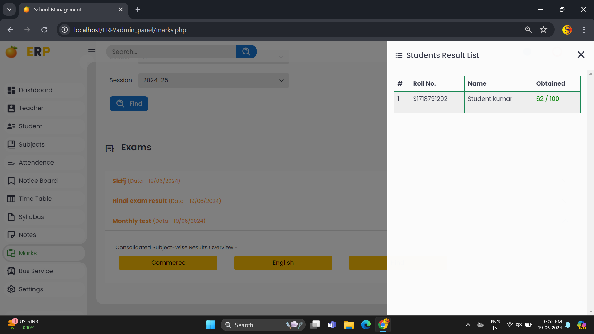
        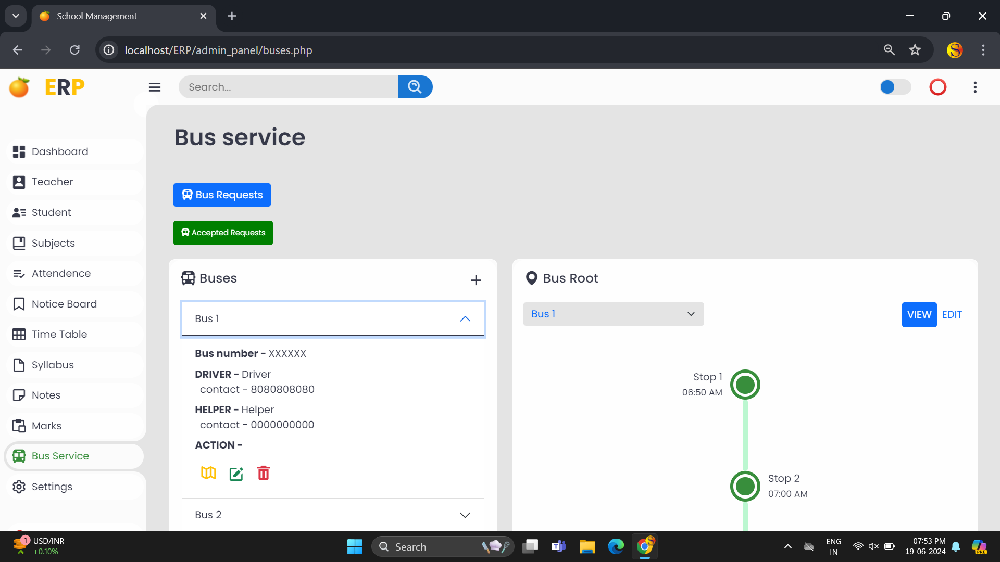
    

     

        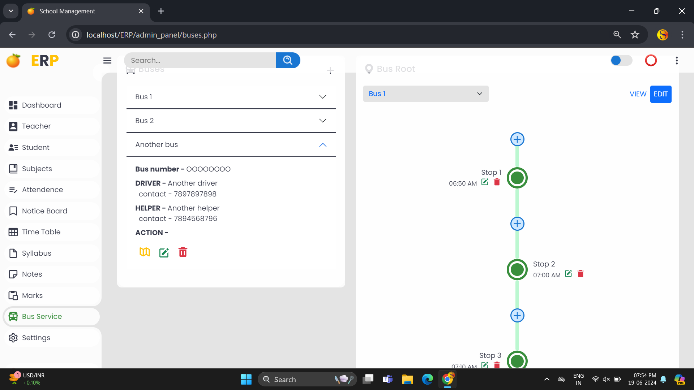
        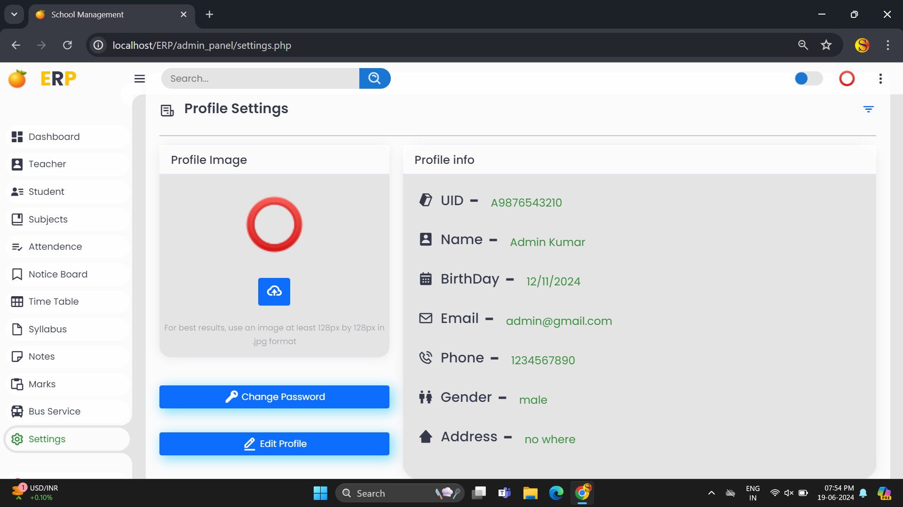
    

 

### Teacher View

    

        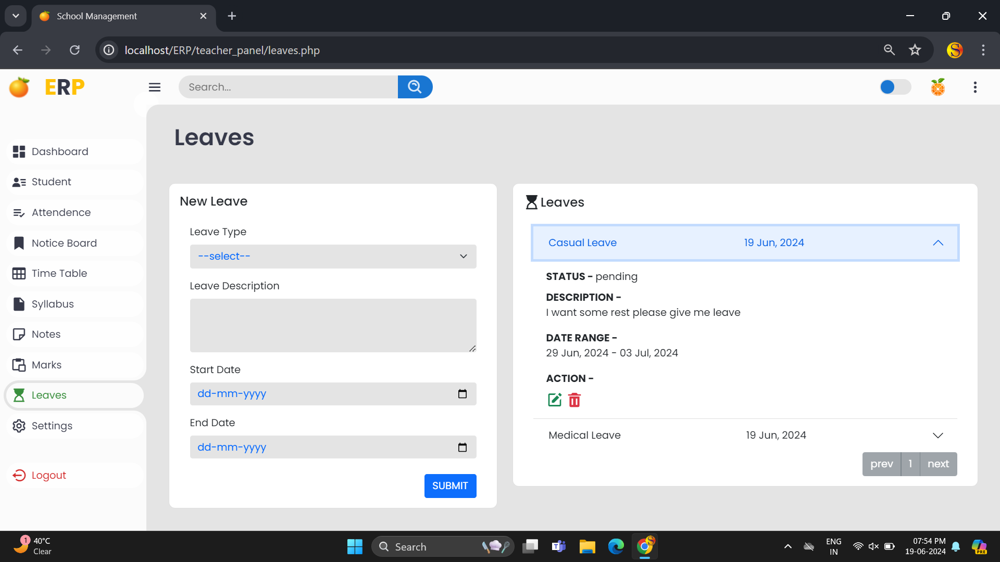
        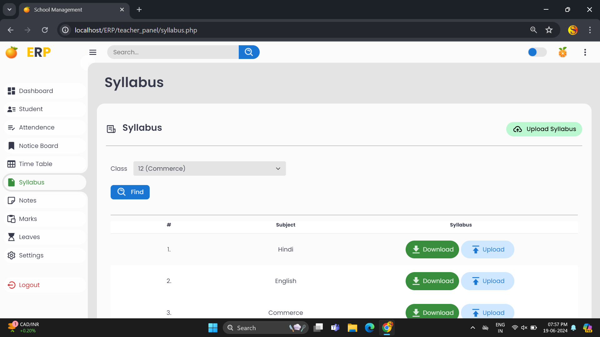
    

 

### Student View

   

        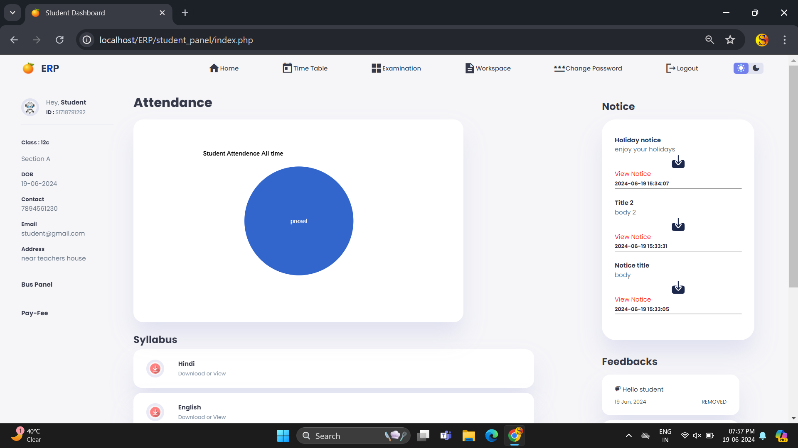
        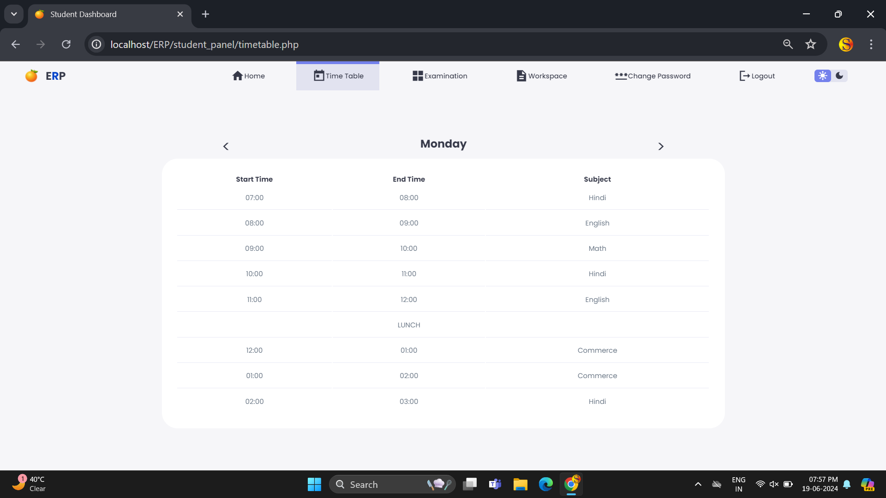
    

    

        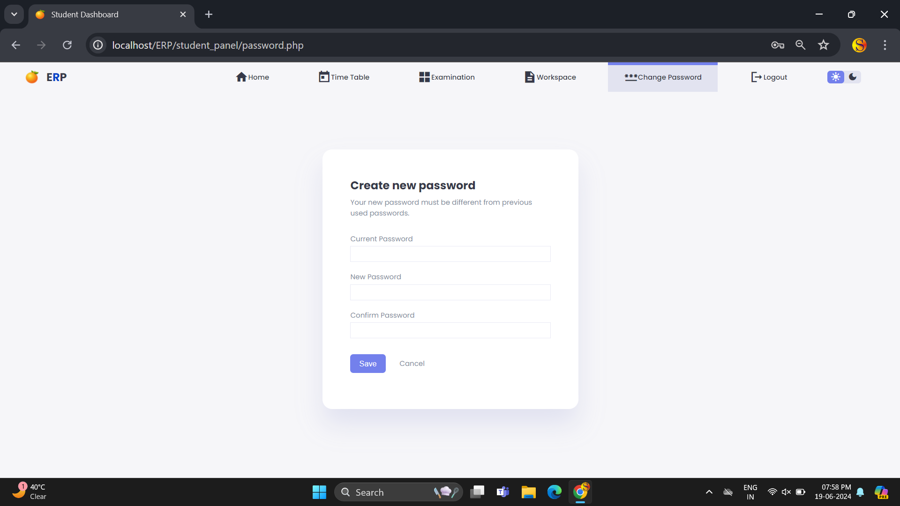
        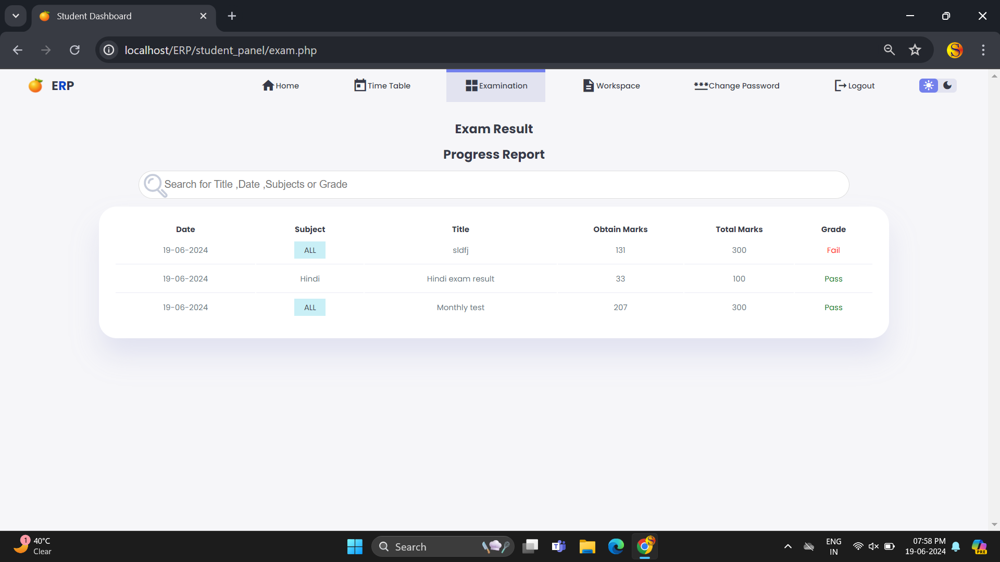
    

    

        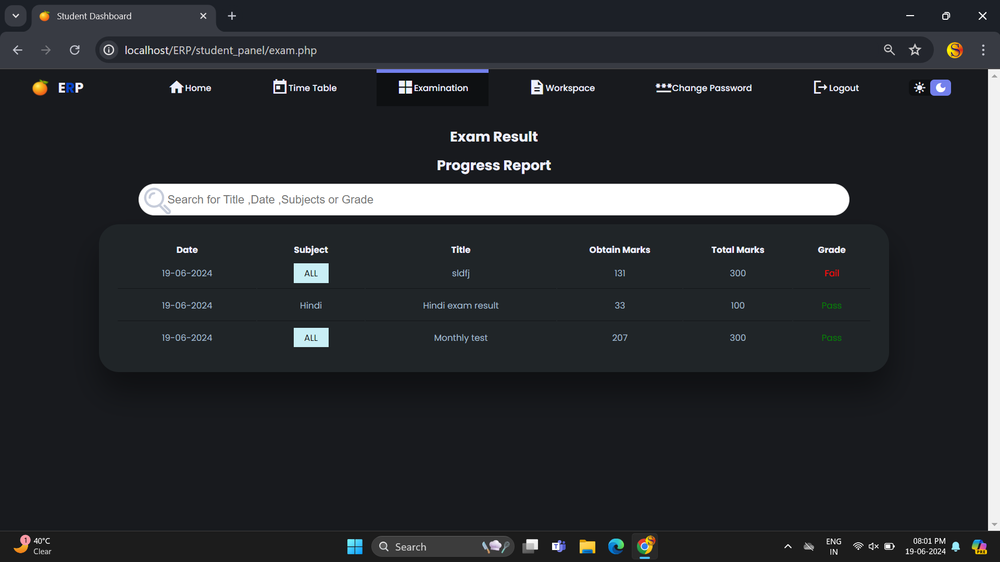
    

    

 

### Owner View

    

        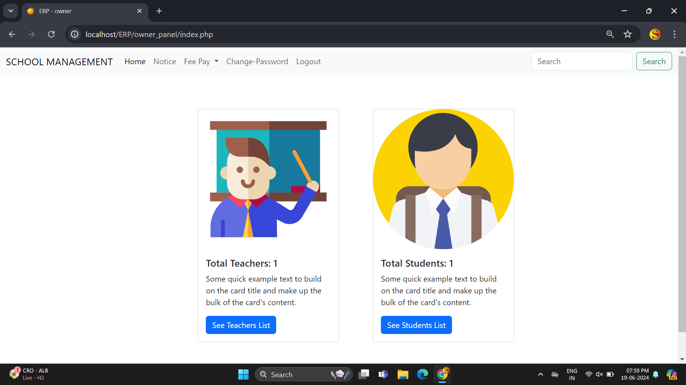
        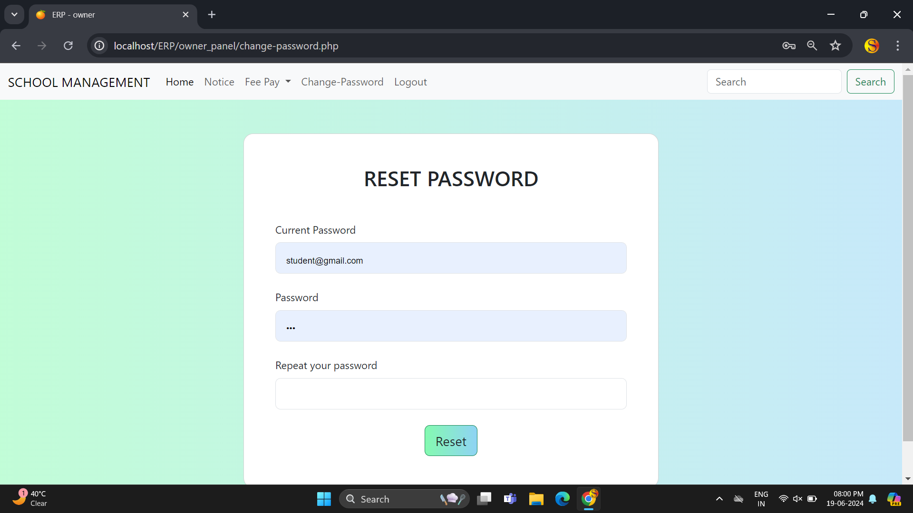
    

    

 

## HOW TO USE?

 

## Contributing

Pull requests are welcome. For major changes, please open an issue first
to discuss what you would like to change.

Please make sure to update tests as appropriate.

